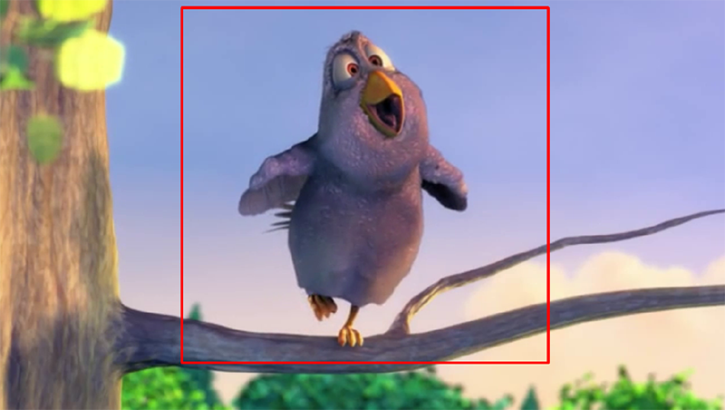

# movie-crop
Crop movies using Python.

Use your mouse to select a region of a frame in the movie, and then you can save the cropped movie or a sequence of images, depending on which parameters you choose. Uses OpenCV and numpy.

## Usage
- In movie_crop.py, in the first two sections set up imports and set the parameters (see code for details).
- Run through remaining sections of the script:
    - Define functions
    - Open movie and view metadata (optional)
    - Preview movie (optional)
    - Open frame to select cropping parameters
    - Save cropped data (either image stack or as another movie)

## Notes
- OpenCV does *not* play nicely with Jupyter so I recommend not using this with Jupyter.
- To save an image stack, set the `save_filetype` parameter to `png`. To save as a movie, set it to `avi` or `mp4`, and also set the compression codec. There are already values set, and suggestions provided, in the parameters section of the script.
- When you save without loss ('FFV1' codec) the files can get huge. For smaller files, I recommend the 'DIVX' codec which compresses really well but retains high quality.
- This is a simple tool: if you want tons of choices/features, I recommend the command-line tool `ffmpeg`. `movie-crop` is basically a front-end wrapper for that.
- Clip is from the open-source cartoon Big Buck Bunny (https://en.wikipedia.org/wiki/Big_Buck_Bunny).
- The standard command-line tool for movie editing is ffmpeg, and opencv typically uses it in the back end. To check in your case you can use `print(cv2.getBuildInformation())` and look for `Video I/O`.
- When making this I did a bunch of experiments saving 500 frames to movies to see which codecs went best with different file types (focusing on `mp4` and `avi` because they are the most common). Results, and other general notes, are in `supplemental.md`.

## About
Part of an analysis pipeline developed with the Neurobehavioral Core at NIEHS:
https://www.niehs.nih.gov/research/atniehs/facilities/neurobehavioral/index.cfm

## To do
- Have separate script that applies params to all movies in a folder.
- Add a rescale option.
- Option to read/save greyscale (imread(image_path, cv2.IMREAD_GRAYSCALE))
- Clicking X should work because this is 2020. But opencv is weird:
https://stackoverflow.com/questions/35003476/opencv-python-how-to-detect-if-a-window-is-closed

## To think about doing
- Put functions in a separate module?
- Have qt file open dialog
- Make into larger scale GUI application rather than program.
